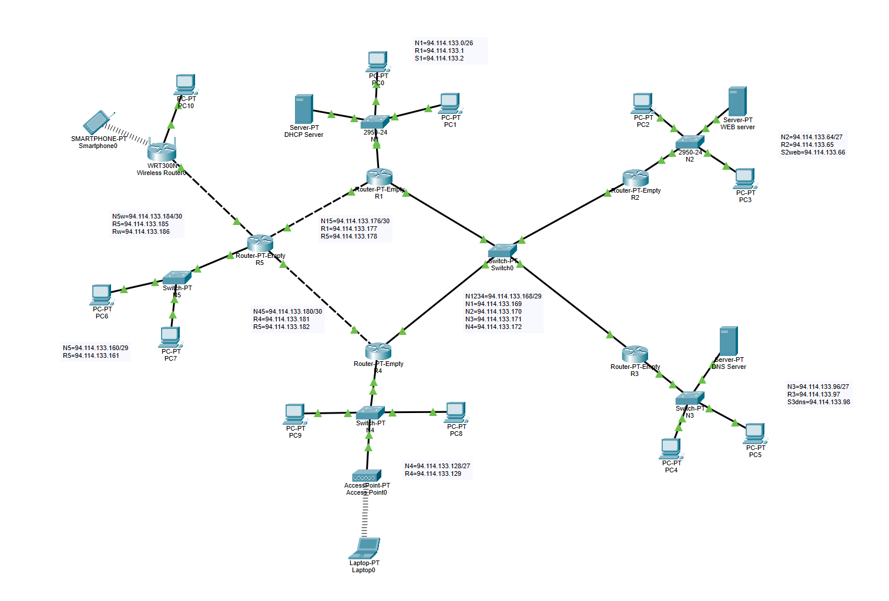

# Network Topology – Cisco Packet Tracer Project

## Overview  
This project represents a simulated enterprise network built in Cisco Packet Tracer, designed to demonstrate routing, subnetting, and network services integration.  
The network is based on the **94.114.133.0/24** address space, divided into multiple subnets using **VLSM**.

## Network Structure  
The topology includes five interconnected routers and several LAN segments with both wired and wireless devices.

### Main Components  
- **Routers (R1–R5):** Manage inter-network communication through static routing.  
- **Switches:** Provide local connectivity for PCs and servers.  
- **DHCP Server:** Automatically assigns IP addresses to hosts.  
- **DNS Server:** Resolves domain names within the network.  
- **Web Server:** Hosts a sample website accessible to all clients.  
- **Wireless Router and Access Point:** Extend connectivity to mobile and wireless devices.

## Features  
- Full communication between all subnets using static routes.  
- DHCP-based automatic IP allocation for clients.  
- Centralized DNS name resolution.  
- Web services available across the entire network.  
- Combination of wired and wireless network access.

## Technologies Used  
- **Cisco Packet Tracer 8.x**  
- **Static Routing**  
- **DHCP Configuration**  
- **DNS Server Setup**  
- **Web Server Configuration**  
- **Wireless Networking**

## How to Open  
1. Download the project file: **Proiect 1 (5).pkt**  
2. Open **Cisco Packet Tracer (version 8.x or higher)**.  
3. Go to **File → Open** and select the `.pkt` file.  
4. Once loaded, you can view device configurations, run connectivity tests (*ping*, web access), and monitor routing tables.
